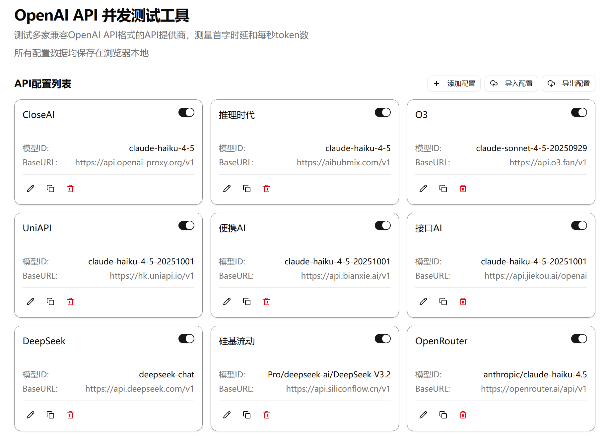
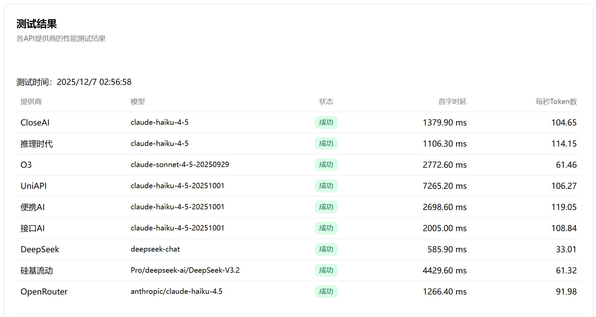

# OpenAI API 并发测试工具

🚀 一款功能强大的OpenAI API基准测试工具，支持多家兼容OpenAI API格式的提供商，实时测量**首字时延(TTFT)**和**每秒token数(TPS)**，帮助您快速评估和对比不同API提供商的性能。
本工具所有配置数据均保存在浏览器本地，不会上传。





## ✨ 功能特性

- 📊 **实时性能监控** - 实时测量API响应时间和吞吐量
- 🔄 **并发测试** - 支持多并发请求同时测试多个API
- 🎯 **多API对比** - 支持同时测试OpenAI、DeepSeek等多家兼容OpenAI格式的API提供商
- 📈 **详细报告** - 生成详细的测试结果表格和性能指标
- 🌙 **深色/浅色主题** - 支持主题切换，适应不同工作环境
- 💾 **配置管理** - 灵活的API配置，支持多模型和多密钥

## 🛠️ 技术栈

| 技术 | 版本 | 说明 |
|------|------|------|
| [Nuxt](https://nuxt.com/) | 4.2.1 | 现代Vue 3全栈框架 |
| [Vue](https://vuejs.org/) | 3.5.25 | 渐进式JavaScript框架 |
| [shadcn/ui](https://ui.shadcn.com/) | 2.4.2 | 基于Radix UI的Vue组件库 |
| [Tailwind CSS](https://tailwindcss.com/) | 4.1.17 | 原子化CSS框架 |
| [TypeScript](https://www.typescriptlang.org/) | 5.9.3 | 类型安全的JavaScript |
| [gpt-tokenizer](https://github.com/js-token/js-token) | 3.4.0 | Token计数器 |

## 📁 项目结构

```
openai-api-benchmark/
├── app/                          # 应用源代码
│   ├── app.vue                   # 根组件（主题切换）
│   ├── pages/                    # 页面组件
│   │   └── index.vue             # 主页面（测试界面）
│   ├── components/               # Vue组件
│   │   ├── TestResultTable.vue   # 测试结果表格组件
│   │   └── ui/                   # UI组件库（shadcn/ui）
│   ├── lib/                      # 工具函数
│   │   └── utils.ts              # 通用工具函数
│   └── assets/                   # 静态资源
│       └── css/
│           └── tailwind.css      # Tailwind样式配置
├── public/                       # 公共静态文件
├── api_config_example.json       # API配置示例文件
├── nuxt.config.ts                # Nuxt配置文件
├── tailwind.config.js            # Tailwind CSS配置
├── tsconfig.json                 # TypeScript配置
├── package.json                  # 项目依赖配置
├── pnpm-workspace.yaml           # pnpm工作区配置
├── Dockerfile                    # Docker容器配置
├── components.json               # shadcn/ui组件清单
└── README.md                     # 项目文档
```

## 🚀 快速开始

### 环境要求

- **Node.js** ≥ 18.x
- **pnpm** ≥ 8.x

### 安装依赖

```bash
# 安装pnpm（如未安装）
npm install -g pnpm

# 安装项目依赖
pnpm install
```

### 配置API

1. 复制配置示例文件：
   ```bash
   cp api_config_example.json api_config.json
   ```

2. 编辑 `api_config.json`，添加您的API配置：
   ```json
   {
     "apis": [
       {
         "name": "OpenAI",
         "base_url": "https://api.openai.com/v1",
         "api_key": "sk-your-api-key",
         "model": "gpt-3.5-turbo",
         "enabled": true
       },
       {
         "name": "DeepSeek",
         "base_url": "https://api.deepseek.com/v1",
         "api_key": "sk-your-api-key",
         "model": "deepseek-chat",
         "enabled": true
       }
     ]
   }
   ```

### 本地开发

```bash
# 启动开发服务器（热重载）
pnpm run dev

# 访问：http://localhost:3000
```

### 生产构建

```bash
# 生成静态文件
pnpm run generate

# 构建应用
pnpm run build

# 预览生产构建
pnpm run preview
```

## 📊 核心功能说明

### 性能指标

| 指标 | 说明 |
|------|------|
| **TTFT** (Time To First Token) | 首字时延，从发送请求到收到第一个token的时间，单位：毫秒 |
| **TPS** (Tokens Per Second) | 每秒token数，衡量API的吞吐量，单位：tokens/s |

### 测试流程

1. **配置API** - 在 `api_config.json` 中配置需要测试的API，并导入，也可以手动添加
2. **输入提示词** - 在UI中输入测试提示词，默认一般不需要更改
3. **设置并发数** - 选择并发请求数量，默认500
4. **开始测试** - 点击开始按钮，工具会对所有已启用的API进行并发测试
5. **查看结果** - 实时查看每个API的性能指标和统计信息

## 🐳 Docker 部署

### 使用Docker运行

```bash
# 构建Docker镜像
docker build -t openai-api-benchmark .

# 运行容器
docker run -p 3000:3000 openai-api-benchmark
```

### Docker Compose（可选）

创建 `docker-compose.yml`：

```yaml
version: '3.8'
services:
  benchmark:
    build: .
    ports:
      - "3000:3000"
    environment:
      - NODE_ENV=production
```

运行：
```bash
docker-compose up
```

## 🔧 可用命令

| 命令 | 说明 |
|------|------|
| `pnpm install` | 安装依赖 |
| `pnpm run dev` | 启动开发服务器（含热重载） |
| `pnpm run build` | 生产构建 |
| `pnpm run generate` | 生成静态站点 |
| `pnpm run preview` | 预览生产构建 |

## 📝 配置说明

### API配置字段详解

```json
{
  "apis": [
    {
      "name": "API显示名称",
      "base_url": "API基础URL",
      "api_key": "认证密钥",
      "model": "模型名称",
      "enabled": true
    }
  ]
}
```

**字段说明：**

- **name** (string) - API提供商名称，用于UI显示
- **base_url** (string) - API基础URL，例如：`https://api.openai.com/v1`
- **api_key** (string) - API认证密钥，OpenAI和DeepSeek的API-Key格式为 `sk-...`
- **model** (string) - 模型名称，例如：`gpt-3.5-turbo`、`deepseek-chat`
- **enabled** (boolean) - 是否在测试中启用该API，设为 `false` 可临时禁用

### 支持的API提供商

- **任意兼容OpenAI API的提供商** - 任何遵循OpenAI API标准的服务

## 🤝 贡献指南

欢迎提交Issue和Pull Request！

### 反馈和建议

- 🐛 **Bug报告** - 请在Issues中详细描述复现步骤
- 💡 **功能建议** - 欢迎提交功能请求和改进建议
- 📝 **文档反馈** - 如发现文档问题，请提交修正

### 联系方式

- 👨‍💻 **作者**: ikiwi
- 📧 **邮箱**: ikiwicc@gmail.com
- 🔗 **GitHub**: [ikiwi/openai-api-benchmark](https://github.com/ikiwi/openai-api-benchmark)

## 🙏 致谢

感谢以下项目和社区的支持：

- [Nuxt](https://nuxt.com/) - 现代Web框架
- [shadcn/ui](https://ui.shadcn.com/) - 组件库
- [Tailwind CSS](https://tailwindcss.com/) - CSS框架
- [OpenAI](https://openai.com/) - API服务

## 📚 相关资源

- [Nuxt官方文档](https://nuxt.com/docs)
- [Vue 3文档](https://vuejs.org/)
- [OpenAI API文档](https://platform.openai.com/docs)
- [Tailwind CSS文档](https://tailwindcss.com/docs)

---

## 📄 许可证

MIT License © 2025 ikiwi

项目作者保留对项目的所有权利。使用本项目代码时，请遵守MIT许可证的条款。
